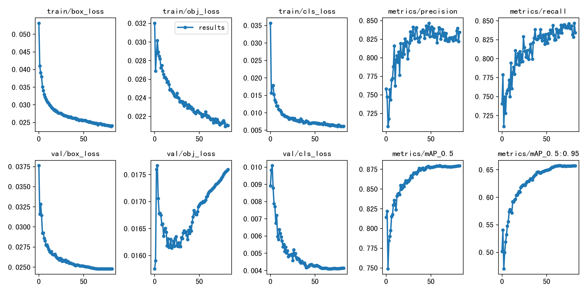

# MidTerm Project

Code for MidTerm PJ  of course `DATA620004` (Neural Networks and Machine Learning) at Fudan University in 2022 spring. 

## Require

* Python 3.8
* Numpy 1.19.2
* Pytorch >= 1.7

## Dataset

**PASCAL VOC (The PASCAL Visual Object Classes)**

This dataset is divided into four major classes: vehicle, household, animal, person, and a total of 20 subclasses.

The VOC 2007 dataset contains 9963 annotated images with 24640 objects, divided into two parts: trainval and test, each accounting for 50% of the total data. VOC 2012 dataset has 11540 images with 27450 objects.

For the target detection task, there is a txt file for each category, where each row is an image from the test set, and each row is organized in the following format.

```xml
<image identifier> <confidence> <left> <top> <right> <bottom>
```

For example:

```xml
000004 0.702732 89 112 516 466
000006 0.870849 373 168 488 229
000006 0.852346 407 157 500 213
000006 0.914587 2 161 55 221
000008 0.532489 175 184 232 201
```

**Training set**: The trainval set in VOC2007 and the trainval set in VOC2012 are used as the training set, a total of 16551 images.

**Test set**: The test set in VOC2007 is used as the test set, a total of 4952 images.

## Training 

- **Clone the repo**: `git clone https://github.com/Lockegogo/FDU_HW/tree/main/DATA620004/MidTerm.git`
- [Download VOC Dataset](https://pan.baidu.com/s/13eYdR4qkRmFqvta6XGuwmQ?pwd=okm7 ) (code: okm7), unzip it  in  folder `./datasets`
- **Train the model**:
  - [Download the trained model](https://pan.baidu.com/s/1Hpd2_3JHHIGPmh9FWOvMrg?pwd=8s52) (code: 8s52), unzip it in folder `./yolov3`
  - or train it by yourself: `python train.py --img 640 --batch 16 --epochs 300 --data voc.yaml --weights yolov3.pt --cache `

- **Test with val.py**: `python val.py --weights best.pt --data voc.yaml --img 640 --iou 0.65 --half`
- For more information, please refer to `main.ipynb`

## Results



## Inference

- **Inference with detect.py**: `python detect.py --weights best.pt --img 640 --conf 0.25 --source data/images`


## References

1. https://github.com/ultralytics/yolov3


